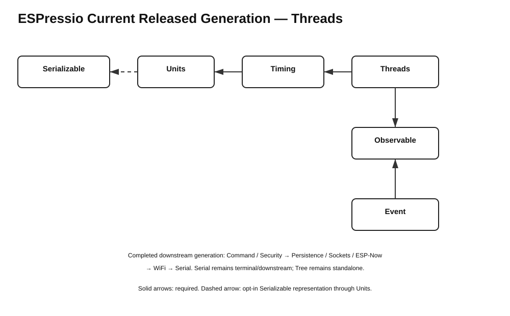

# ESPressio Dependency Chart — Serializable 0.11.2 Cascade



Arrows point from a consuming library to the library it consumes. **Required** edges are part of the normal package contract; **opt-in** edges exist only when the corresponding integration/header is selected.

## Released cascade baseline

```text
Observable    3.0.2
Serializable  0.11.2
Units         0.2.6
Timing        2.2.7
Threads       3.1.6   (this release)
```

## Current Threads edges

```text
Threads 3.1.6
    -> Timing >= 2.2.7 < 3.0.0        required
    -> Observable >= 3.0.2 < 4.0.0    required

Threads
    - - -> Serializable                opt-in/transitive only
            via ESPressio_PrecisionThread_Serializable.hpp
            and Units Serializable time/frequency representations
            validated with Units 0.2.6 + Serializable 0.11.2
```

Threads deliberately does **not** declare Serializable as a core package dependency. The ordinary `ESPressio_PrecisionThread.hpp` surface remains serialization-agnostic.

## Cascade propagation

```text
Serializable 0.11.2
        |
        v
Units 0.2.6
        |
        v
Timing 2.2.7
        |
        v
Threads 3.1.6
        |
        v
Event 6.0.2
        |
        +--> Command / Security
        |          |
        |          v
        |      downstream transports
        |
        +--> ESP-Now / Sockets / Serial
```

Later libraries in the release train must not claim a new upstream version until that upstream version is actually released.

## Dependency-direction invariants

- Timing owns clock/time algorithms and depends on Units + Observable.
- Threads owns execution/threading and depends on Timing + Observable.
- Serializable representations remain opt-in at the appropriate integration boundary.
- Event may consume Threads; Threads must not depend on Event.
- Serial remains terminal/downstream.
