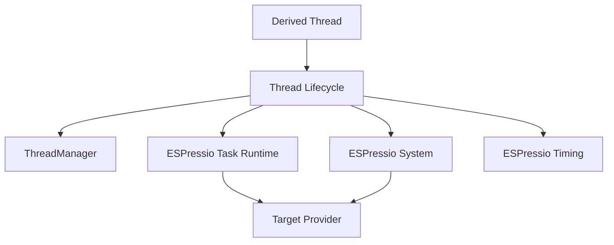

# Extension Architecture

Threads is the portable lifecycle/scheduling layer above ESPressio Task and System.

## Threads owns

Persistent worker lifecycle, precision scheduling, termination coordination, manager/registry semantics, cleanup policy, priority/affinity requests, lifecycle observers and developer-facing synchronization utilities.

## Threads does not own

Target-native public handles/types, raw platform processor discovery, target scheduler implementation, radio/network work routing, or arbitrary application state safety.

## Extension invariants

Preserve start/termination ordering, manager lock boundaries, callback reentrancy safety, automatic-cleanup claims, bounded infrastructure, portable public configuration and the distinction between ESPressio-owned versus runtime-owned memory.