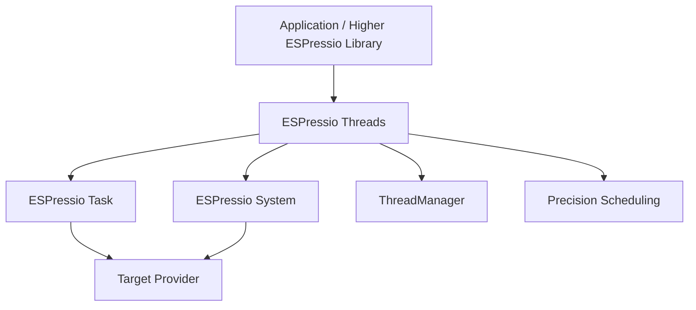

# ESPressio Threads

> Documentation baseline: **1.0.0**

ESPressio Threads provides long-lived worker lifecycle, precision scheduling, thread management, termination/cleanup coordination and observability above ESPressio Task and ESPressio System.

Threads models **persistent workers**. ESPressio Task models discrete asynchronous work. Native scheduler/RTOS execution is supplied below these abstractions by the platform provider stack.

## Choose your documentation path

### Using the library

- [Getting Started](Getting-Started)
- [Thread Lifecycle](Thread-Lifecycle)
- [Thread Configuration](Thread-Configuration)
- [Manager and Registry](Manager-and-Registry)
- [Termination and Cleanup](Termination-and-Cleanup)
- [Precision Threads](Precision-Threads)
- [Thread Observers](Thread-Observers)
- [Thread Safety Utilities](Thread-Safety-Utilities)
- [Task versus Threads](Task-versus-Threads)
- [Resource and Memory Behaviour](Resource-and-Memory-Behaviour)

### Extending the library

- [Extension Architecture](Extension-Architecture)
- [Execution Backend Boundary](Execution-Backend-Boundary)
- [Lifecycle and Termination Contract](Lifecycle-and-Termination-Contract)
- [Manager Registry Contract](Manager-Registry-Contract)
- [Precision Scheduling Contract](Precision-Scheduling-Contract)
- [Testing Thread Extensions](Testing-Thread-Extensions)

## Architecture

Threads owns lifecycle semantics; it does not make native FreeRTOS handles part of the public developer contract.